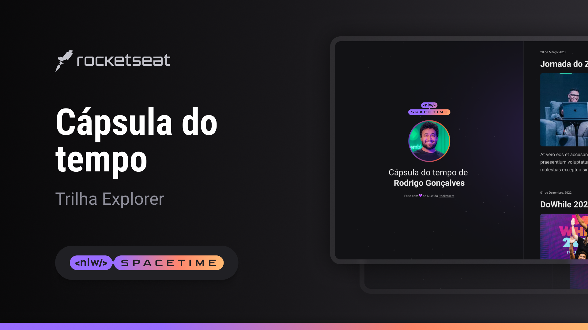

 
  

## Projeto🖥️
Esse é um projeto responsivo é uma cápsula do tempo para exibir memórias em uma linha do tempo

## Tecnologias 🚀
Esse projeto foi desenvolvido durante a NLW da Rockeseat com as seguintes tecn.;

- HTML
- CSS
- GIT E GH

## Layout 
Você pode visualizar o layout do projeto através [desse link](https://www.figma.com/file/wRSSyCj2LjI2l2p0EuG84T/C%C3%A1psula-do-tempo-%E2%80%A2-Trilha-Explorer-(Community)-(Copy)?type=design&node-id=306%3A84&t=kRj45tlfhrqGNrRJ-1).

É necessário ter uma conta no [Figma](https://www.figma.com)